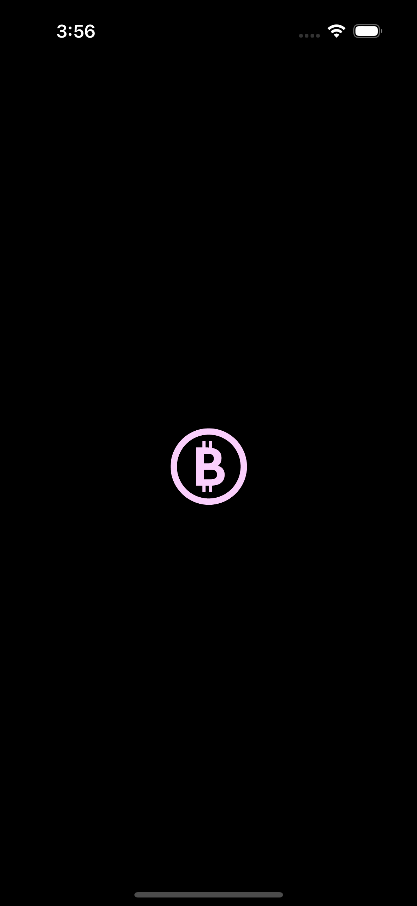
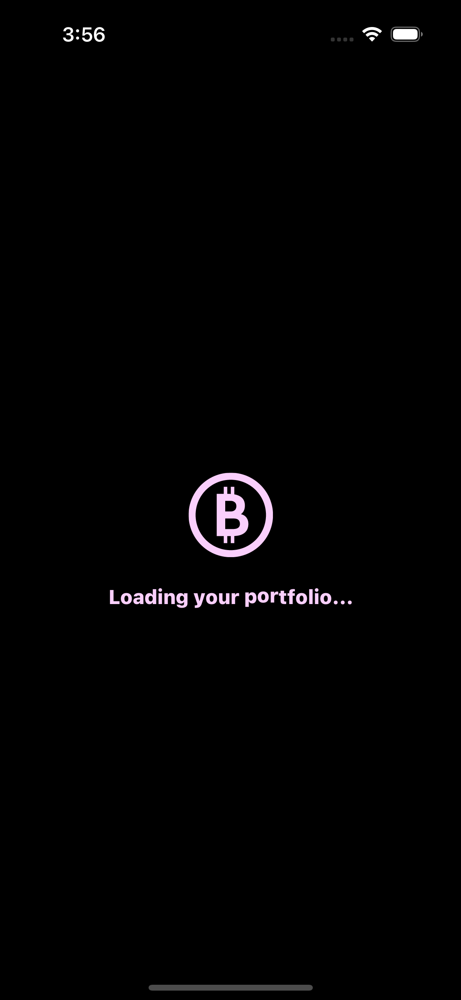
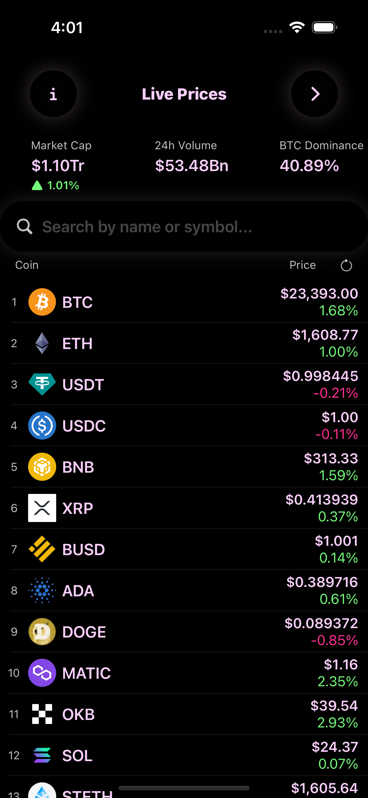
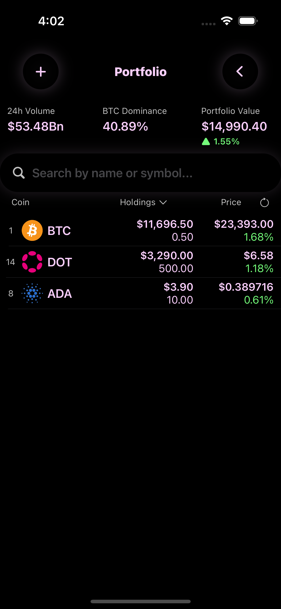
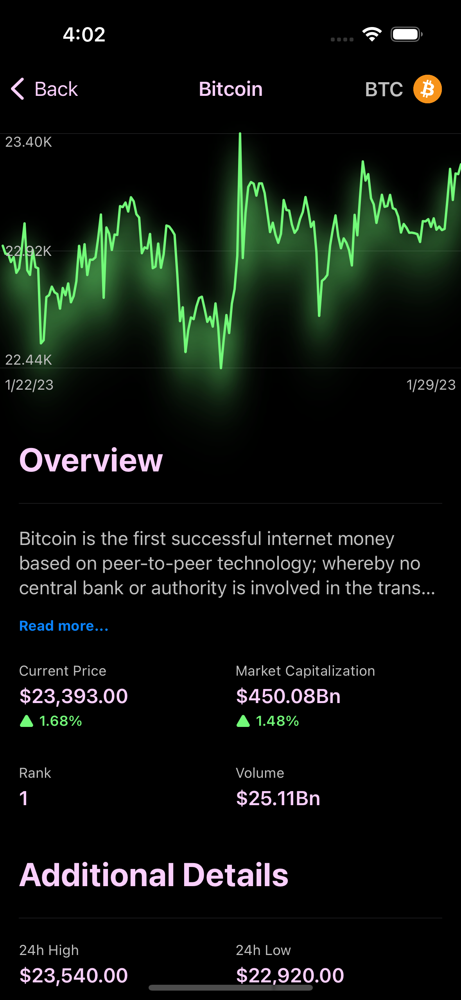

This is sample project created referring [Youtube playlist](https://www.youtube.com/playlist?list=PLwvDm4Vfkdphbc3bgy_LpLRQ9DDfFGcFu)

This app was made by following a [@SwiftfulThinking](https://www.youtube.com/c/swiftfulthinking) on Youtube. It uses MVVM Architecture, Combine, and CoreData!

The cryptocurrency data that is used in this app comes from a free API from [CoinGecko](https://www.coingecko.com)! Prices may be slightly delayed.

# App Screenshots:
 
 

